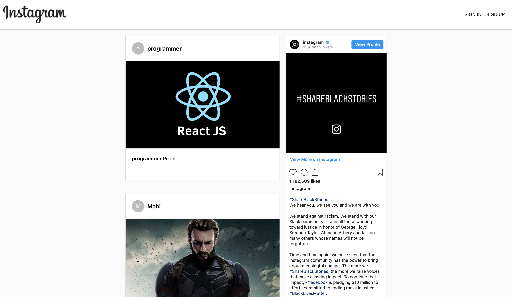
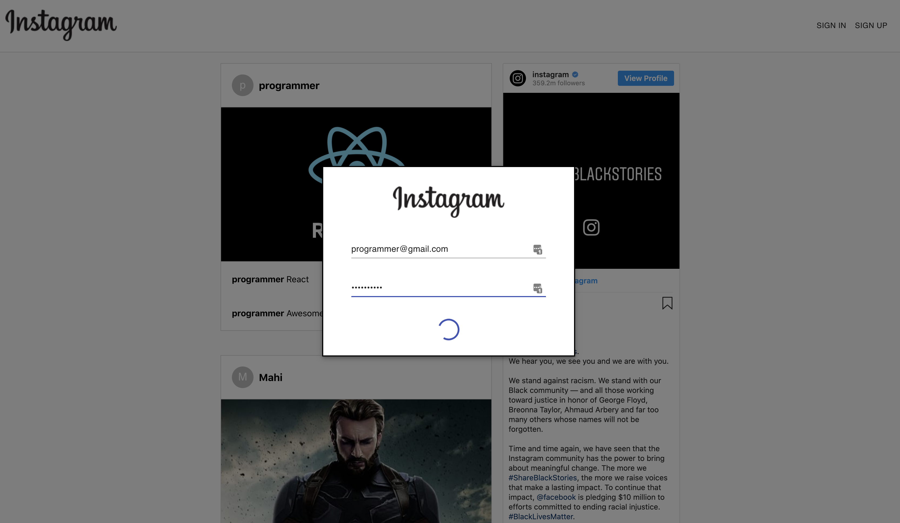
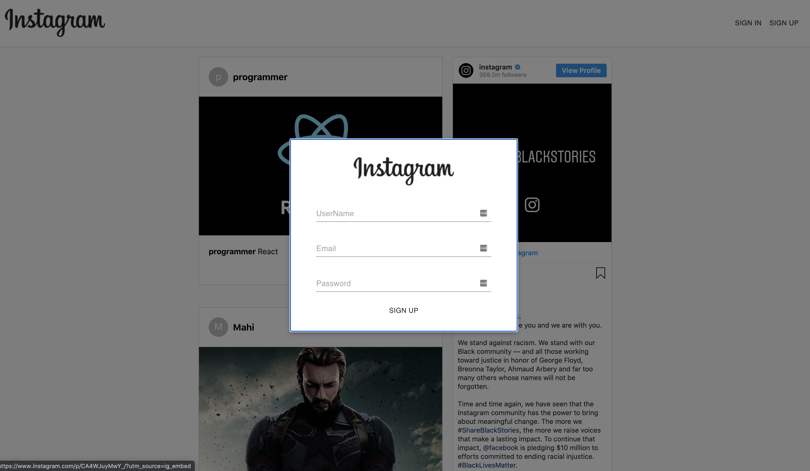
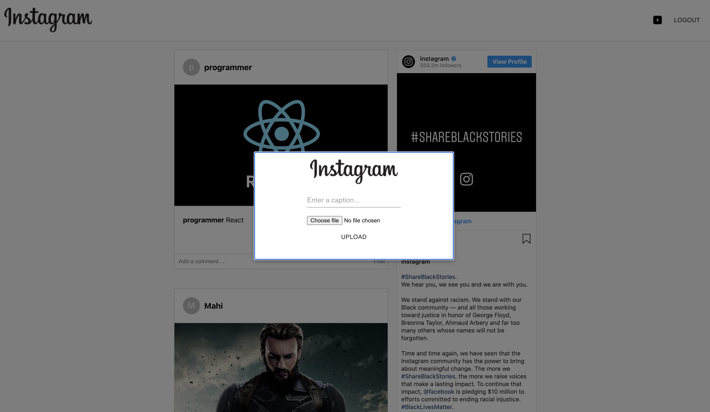

# INSTAGRAM CLONE

Instagram Clone created using React and Firebase. This allows users to Login or Signup and create posts. Other users can comment on the posts.

## Hosted on Firebase

Live Demo - [Click here](https://instagram-clone-2e5d0.web.app/)

## Sample Screenshots

### Home Page

### Login

### SignUp

### Create Post

## To run locally

`npm install`

`npm start`
